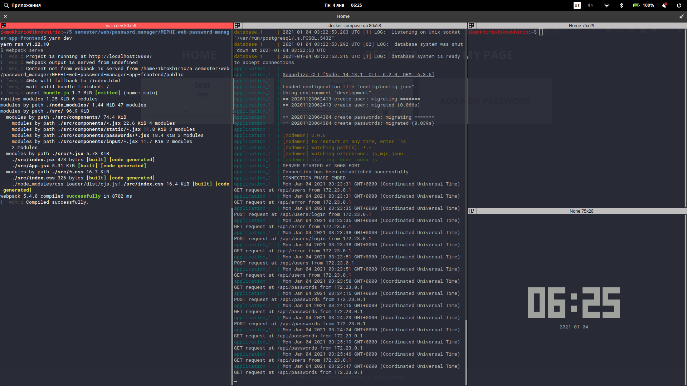

# Password manager web application backend (express)
 > Simple web app created with react+express

# Showcase


> Backend in work

## Installation

* First you need to install [docker and docker-compose](https://docs.docker.com/compose/install/).
* After install you should clone project from github
* Create the new network, called 'dev'
```sh
docker network create dev
```
* Start docker-compose
```sh
docker-compose up --build
```
* Do not forget to clone [frontend](https://github.com/Ikmokhirio/MEPHI-web-password-manager-app-backend) or use your own